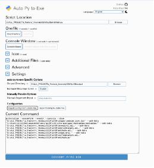
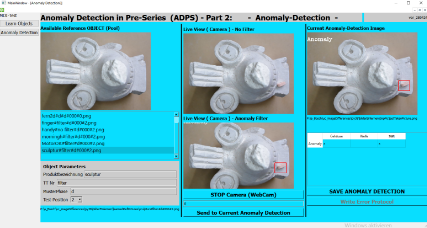
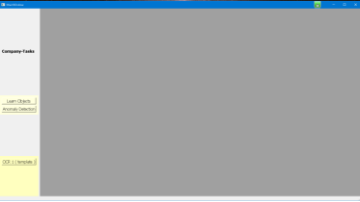
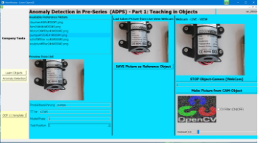
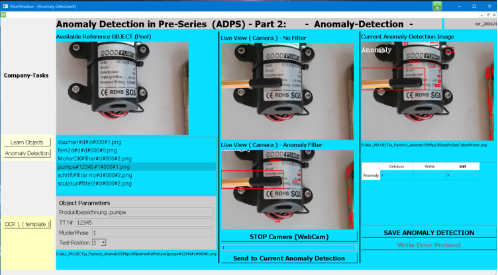

**Anomaly Detection in Pre -Series ( ADPS) - Structural\_Similarity ( SSIM ) + MSE (Mean Squared Error)**

Date: 28.04.24

D :/ ALL\_PROJECT/a\_Factory/\_AnomalySSIM/py38 
Basis for this LAB is the doc: 
D:\ALL\_DEVEL\_VIP\DOC\Anaconda\_PY\_ObjectDetect\_Tensor\_ORANGE\How2 ADPS\_anaomalyDetectionPreSeries\_V01\_.docx

Local: D :/ ALL\_PROJECT/a\_Factory/\_AnomalySSIM/py38

**Why thisExperiment ?**

The background for this experiment is/was the task of detecting anomalies in objects without any training material ( eg there is not enough input for classical machine learning !) 
. Specifically: 

-detect diffuse production defects on motors, pumps or other objects .

-Error types in small numbers that cannot be fed into a classic machine learning algorithm

-The basis of the experiment should be SSIM ( **Structural\_Similarity )**

The complete experiment ( code ) is available in Github !

Tested under **python 3.8** / Spyder / Anaconda / Win10

EXE file:

 import this in auto- py -to-exe ( MUST adapt the path etc..)

**

**Conclusion (28.04.25)**

 

**Pro:**

- The GUI for input/learning ( **LearnUI** ) is available. An object can be recorded from the connected external camera and saved in a corresponding directory. The steps are simplified for the user with GUI support.
- The GUI for **anomaly detection accesses the** reference data stored 
  in the LearningUI . In this POC we use [Structural](https://scikit-image.org/docs/dev/api/skimage.metrics.html?highlight=ssim#skimage.metrics.structural_similarity)[Similarity ](https://scikit-image.org/docs/dev/api/skimage.metrics.html?highlight=ssim#skimage.metrics.structural_similarity)[Index ](https://scikit-image.org/docs/dev/api/skimage.metrics.html?highlight=ssim#skimage.metrics.structural_similarity)( ssim ). As can be seen in the image above . Basically, the procedure ( ssim ) works in the running videoCam stream against the saved reference image. ( CONS see below )
- In an MDI interface ( multi document interface ) both the LearningUI and the AnomalyUI are combined in ONE application !

**Con :**

- SSIM has its well-known Limitations : *MSE and SSIM are traditional computer vision and image processing methods to compare images. They tend to work best when images are near-perfectly aligned (otherwise, the pixel locations and values would not match up, throwing off the similarity score).*  - <https://pyimagesearch.com/2014/09/15/python-compare-two-images/#pyis-cta-modal>  
  We were only able to determine in detail how high this sensitivity is in these practical tests. *(.. **Limitations:** Although this method works very well, there are some important limitations. The two input images must have the same size/dimensions and also suffers from a few problems including scaling, translations, rotations, and distortions. SSIM also does not perform very well on blurry or noisy images… [https://stackoverflow.com/questions/11541154/checking-images-for-similarity-with-opencv* ](https://stackoverflow.com/questions/11541154/checking-images-for-similarity-with-opencv)*)
- the taught object from the device and later reinserting it in the "same" position for anomaly detection leads to a poor "score". 
  Similarity score OK (NO object movement ): Similarity: **98.4400% MSE = 16.05** 
  Similarity\_ISSUE (min. position change or lighting conditions ): **66.3600% MSE = 2948.52** 
  (MSE: 'Mean Squared Error' between the two images is the - sum of the squared difference between the two images )

**Conclusion** : 

We will further refine this SSIM-based detection using various filters ( noise , gauss , etc. ) . Certainly some interference effects can be reduced, but these “ SSIM limitations ” cannot be completely eliminated .

Studying in parallel we of course other Methods of anomaly detection .. e.g .: **AutoEncoders** 
*In the context of anomaly detection, AutoEncoders are particularly useful. **They are trained on normal data to learn the representation of the normal state** . During inference, if an input significantly deviates from this learned representation, the AutoEncoder will likely reconstruct it poorly. ( [https://medium.com/@weidagang/demystifying-anomaly-detection-with-autoencoder-neural-networks-1e235840d879 ](https://medium.com/@weidagang/demystifying-anomaly-detection-with-autoencoder-neural-networks-1e235840d879))*

**GUI**

Main window (mdiMain.py)

setupMain.py

teaching in the reference images

anomalyMain.py

The anomaly is detected perfectly via ssim ! BUT please read the **conclusion (CON)** !

**Development environment/Insights:**

|
Finally POC is running under PY3.8 / PyQT5 and VERY important the opencv ( cv2 ) must be implemented with PIP ( not conda )… THIS was necessary in case of creating an executable (. EXE) file!! Pyinstaller had huge problems with CV2 eg . Ffmpeg etc …after long recherché got the info with pip instead of conda …now we are able to build the .EXE-file and run itJ

|**VIP info** – how to develop /run the application|
| :- | :- |
|
Anaconda navigator 2.5.3

Spyder (call via a-prompt)

Anaconda env (py38)

Python 3.8

Pyqt5 Qt : v 5.15.8 / PyQt : v 5.15.9

OpenCV 4.9.0

auto- py -to-exe 2.4.2 ( incl. pyinstaller )
|Main Components (libs) and Versions|
|||
|
*Your code works fine, and, when I ran the steps mentioned in your question, the program worked fine for me. Since pyinstaller compiled everything properly, this may be an issue where the wrong package is installed. Make sure you installed opencv -python ( pip install opencv -python ).*

|
**UPvote** for THIS hint!!!

<https://stackoverflow.com/questions/67494128/pyinstaller-modulenotfounderror-no-module-named-cv2>

|

